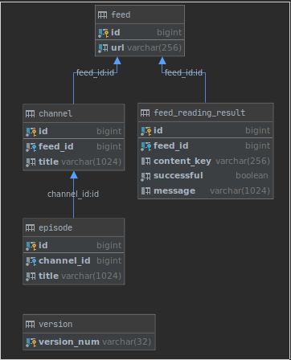

# Podcastindex aggregator ETLs

Extract, transform, load (ETL) components of podcastindex aggregator. 
Implements baseline functions for reading and persisting RSS feeds' metadata.

## Prerequisites
1. Linux (tested with Ubuntu 18.04)
2. python 3.6.1 or higher, pip3.
3. make.
4. Docker (tested with version 19.03.6).
5. Secrets to be place in secrets folder. See secrets/*.sample files. To run a local Docker cluster, use the following files:

    ```bash
   $ cat secrets/podcastindex_blockstorage.json
    {
      "address": "localhost:9000",
      "access_key": "podcastindex",
      "secret_key": "podcastindex"
    }
    ```

    ```bash
   $ secrets/podcastindex_database.json
    {
      "database": "podcastindex",
      "address": "localhost",
      "user": "postgres",
      "password": "postgres",
      "port": "5432"
    }
    ```
   
   ```bash
   $ secrets/podcastindex_bus.json
    {
      "address": "localhost",
      "port": 9092
    }
    ```

## Getting started
Following commands will provision a local Docker cluster with a few auxiliary services, aggregator scheduler and worker:
1. `git clone https://github.com/sarastinishi/aggregator.git` - clone aggregator repo.
1. `git checkout develop && cd etl` - checkout develpo branch and navigate to etl directory. 
1. `make build` - build and provision Docker images woth Postgres DB, Minio block, Kafka message bus and an aggregator itself. Run `docker images` to see a list of created images.
1. `make up` - provision a Docker cluster. See [docker-compose.yml](docker/docker-compose.yaml) for more details. To list running containers run `docker ps -a`
1. `make down` - tear down local Docker cluster.

## Main entry points
Following entrypoints can also be used outside Docker environment. Use them together with `make up-services`. 
|Entry point|Command|Comments|
|:---|:---|:---|
|ensure-db|`make ensure-db`|Create or upgrade a database instance|
|drop-db|`make drop-db`|Create or upgrade a database instance|
|import-feeds|`make import-feeds`|Import feed urls from json file to a database|
|run-scheduler|`make run-aggregator`|Launch scheduler, that cycles through available RSS feeds and submits them for processing|
|run-worker|`make run-aggregator`|Listens to a message bus and parses RSS feeds saving results to a database|

## Other terminal commands
Run `make help` or `make` to get them.
```
init             Initialize virtual environment
shell            Run python shell
revision         Create Alembic database revision (requires name parameter to be initialized)
build            Build Docker images
up               Provision local Docker cluster
up-services      Provision local Docker cluster with a database (Postgres), block storage (Minio) and a message bus (Kafka)
down             Tear down local Docker cluster
ensure-db        Create or upgrade a database instance
drop-db          Create or upgrade a database instance
import-feeds     Import feed urls from json file to a database
run-scheduler    Run aggregation scheduler
run-worker       Run crawling and parsing worker
test             Run automatic tests
flake8           Check basic code style conventions
```

## Database
Following DB structure is just a part of a prototype and will be changes later.



## Known issues
1. When running `make ensure-db` for the first time expected exception is printed. It can be safely ignored.